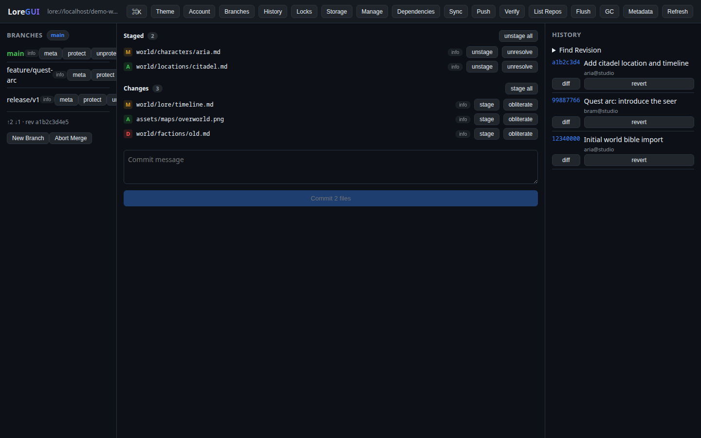
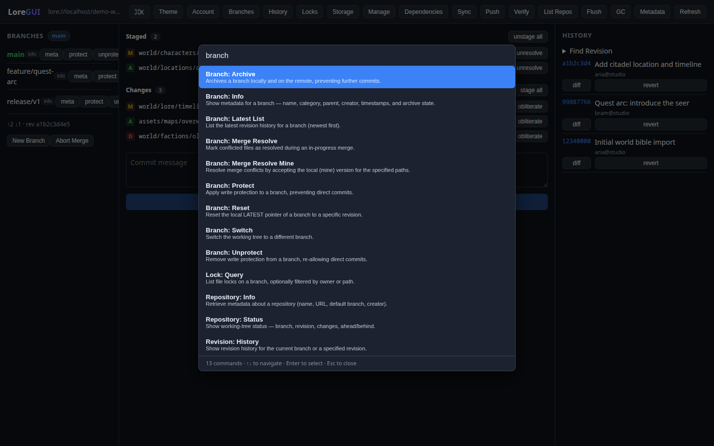
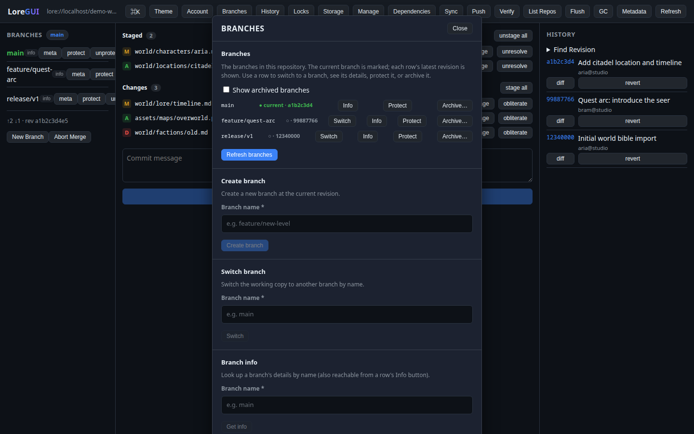
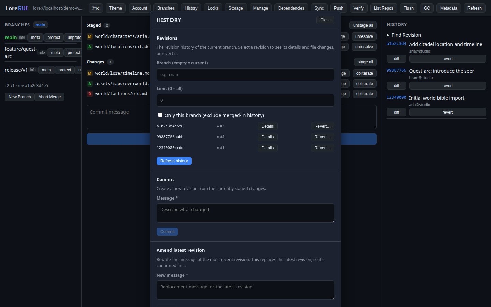
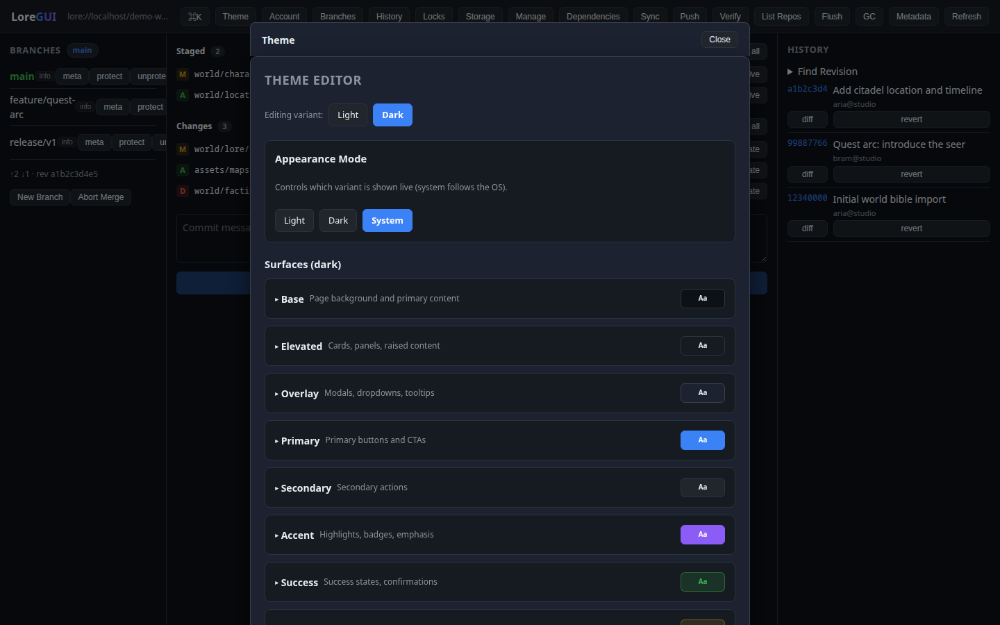
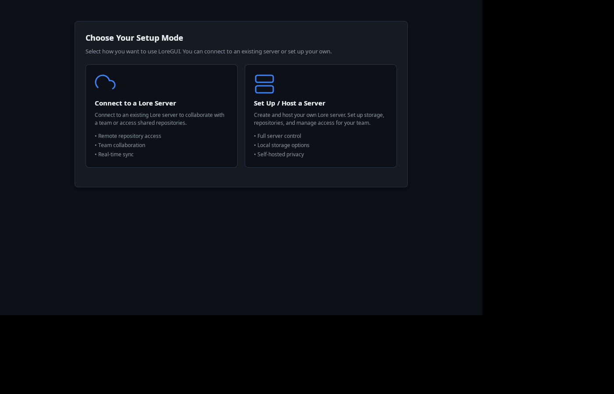

# LoreGUI

<div align="center">



A fast, themeable, **cross-platform desktop GUI** for [Lore](https://github.com/EpicGames/lore) — Epic Games' next-generation version control for source code **and** giant binary assets. Stage, branch, merge, diff, and lock files without touching the command line. Agent-native, with a built-in MCP server.

[](https://BrainDeadGuild.com/discord)
[](https://BrainDead.TV)
[](https://loregui.com)
[](LICENSE)
[](https://github.com/BiloxiStudios/loregui/releases)

</div>

> **Community project.** Not affiliated with or endorsed by Epic Games. "Lore" is a trademark of Epic Games, Inc. Licensed under MIT.

---

## 🤖 For AI agents

> **Agents:** read [`.claude/skills/loregui/SKILL.md`](.claude/skills/loregui/SKILL.md) — it's the single entry point to install, set up the MCP, configure, and drive LoreGUI.

---

## Overview

LoreGUI drives Lore's **complete native API** in-process — it binds the `lore` Rust crate directly, with **no CLI shelling and no background daemon**. Every operation runs at native speed in the same process: status, staging, commits, branches, merge/diff, file locking, and the full operation surface across 14 domains.

It's built for the way modern game and film pipelines actually work — content-addressed storage, sparse on-demand hydration of multi-terabyte repos, and exclusive locks for binaries that can't be merged — all in one signed installer with nothing to babysit.

LoreGUI is also **agent-native**: it ships an MCP server that exposes lore operations as tools so AI coding assistants can drive your repository directly.

<div align="center">

</div>

## Features

- **Universal command palette** — every lore op is reachable by name from one keystroke, with typed inputs and inline help (palette parity is a CI gate).
- **Rich per-domain panels** — branches, history, locks, storage, dependencies, and more, each a first-class view.
- **Visual branch, merge & diff** — read the commit DAG at a glance, compare any two revisions, resolve merges in a focused three-way view.
- **File locking for binaries** — claim exclusive locks, see who holds what in real time, release with one click.
- **Host or connect** — onboard a new repo by connecting to a server or hosting one yourself. The **Host a server** flow has a guided config surface: a one-field Basic mode for a local server, and an Expert mode exposing all 54 lore-server options (network/QUIC/gRPC/HTTP, storage, topology & mTLS replication, telemetry, runtime, notifications, features, timeouts). LoreGUI generates the `loreserver` TOML for you — view it with one click; you never hand-edit config.
- **Fully themeable** — semantic surface tokens drive a light/dark/custom theme system; the whole UI re-themes.
- **MCP support** — a built-in MCP server lets AI agents drive lore, one tool per operation.
- **Signed, multi-platform releases** — single installer per platform, published to GitHub Releases (Windows & Linux now, macOS soon).

## Screenshots

<table>
<tr>
<td align="center" width="50%">
<br>
<sub><b>Branches</b> — the commit DAG and branch management</sub>
</td>
<td align="center" width="50%">
<br>
<sub><b>History</b> — revision history and diffs</sub>
</td>
</tr>
<tr>
<td align="center" width="50%">
<br>
<sub><b>Theming</b> — fully themeable, semantic surface tokens</sub>
</td>
<td align="center" width="50%">
<br>
<sub><b>Onboarding</b> — connect to a server or host your own</sub>
</td>
</tr>
<tr>
<td align="center" width="50%">
<br>
<sub><b>Host a server (Expert)</b> — all 54 lore-server options in one surface</sub>
</td>
<td align="center" width="50%">
<br>
<sub><b>Generated config</b> — LoreGUI writes the <code>loreserver</code> TOML; view it, never hand-edit it</sub>
</td>
</tr>
</table>

## Install

**Quick install** — download the latest signed installer from [**GitHub Releases**](https://github.com/BiloxiStudios/loregui/releases/latest) and run it (Windows & Linux now, macOS soon).

**Build from source** — with Rust (stable, edition-2024-capable), Node 20+, and the Tauri v2 system deps for your platform:

```bash
npm --prefix frontend install && cargo tauri build   # → platform installer
```

For hot-reload development: `cargo tauri dev` (from `src-tauri/`).

📖 Full docs and downloads: **[loregui.com](https://loregui.com)** · **[loregui.com/docs](https://loregui.com/docs)**

## MCP support

LoreGUI ships an **MCP server** so AI agents can drive lore directly — it registers **one MCP tool per operation** (status, history, diff, commit, branch, stage/unstage, locks, …) plus a `lore_repo_summary` aggregate. The tool catalog is generated from LoreGUI's command-palette manifests, so the agent surface stays in lock-step with the GUI.

Register it with your agent's `mcpServers` config:

```json
{
  "mcpServers": {
    "lore": {
      "command": "/path/to/loregui/lore-mcp/venv/bin/python",
      "args": ["/path/to/loregui/lore-mcp/server.py"],
      "env": {
        "LORE_REPO": "/path/to/your/lore/repo",
        "LOREVM_BIN": "/path/to/loregui/target/release/lorevm",
        "LORE_OFFLINE": "1"
      }
    }
  }
}
```

Full setup, the tool list, and configuration: [`lore-mcp/README.md`](lore-mcp/README.md). Pair it with the [`.claude/skills/lore`](.claude/skills/lore) skill for the git/p4 → lore mental model.

## Architecture

| Path | What |
|---|---|
| `crates/lore-vm/` | Reusable, GUI-agnostic core. Binds the `lore` crate; one file per operation. |
| `src-tauri/` | Tauri v2 desktop shell. One command per operation. |
| `frontend/` | The GUI (Vite + React + TypeScript). Per-domain panels + universal command palette. |
| `lore-mcp/` | MCP server exposing lore ops as agent tools (one tool per op). |
| `website/` | Marketing landing site (Next.js) for [loregui.com](https://loregui.com). |
| `docs/IMPLEMENTATION-PLAN.md` | Full-parity build plan and ticket tree. |

`lore-vm` is intentionally decoupled from the GUI so it can also be embedded in larger tooling.

## Status

Pre-1.0, under active development against a pinned upstream `lore` revision. See [`docs/IMPLEMENTATION-PLAN.md`](docs/IMPLEMENTATION-PLAN.md) for the parity roadmap and contribution workflow.

## License & third-party notices

LoreGUI is MIT-licensed (see [`LICENSE`](LICENSE)). The distributed binary bundles the upstream Lore crate, the `loreserver` sidecar, and many open-source Rust/npm dependencies — all permissive. Generated attribution bundles: [`THIRD-PARTY-LICENSES.md`](THIRD-PARTY-LICENSES.md) (index), [`NOTICE`](NOTICE), and the in-app **Settings → About & third-party licenses** view. Regenerate with `bash scripts/gen-licenses.sh`; CI ([`licenses.yml`](.github/workflows/licenses.yml)) verifies they don't drift.

---

<div align="center">

## 🧠 BrainDeadGuild

**Open tools for creative production**

Created by **BizaNator**

[loregui.com](https://loregui.com) | [BrainDeadGuild.com](https://BrainDeadGuild.com) | [BrainDead.TV](https://BrainDead.TV) | [GitHub](https://github.com/BrainDeadGuild) | [Discord](https://braindeadguild.com/discord)

*Building tools for the BrainDeadGuild community*

---

**A Biloxi Studios Inc. Production**

© 2026 Biloxi Studios Inc.

</div>
